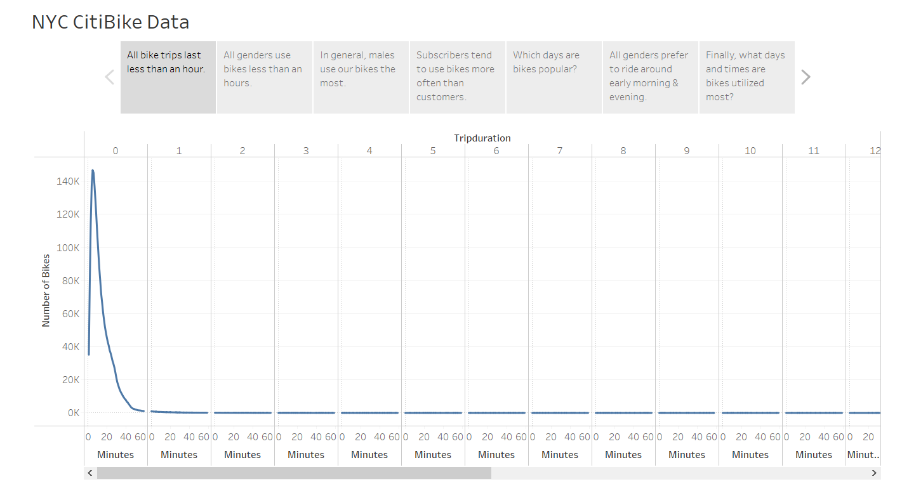
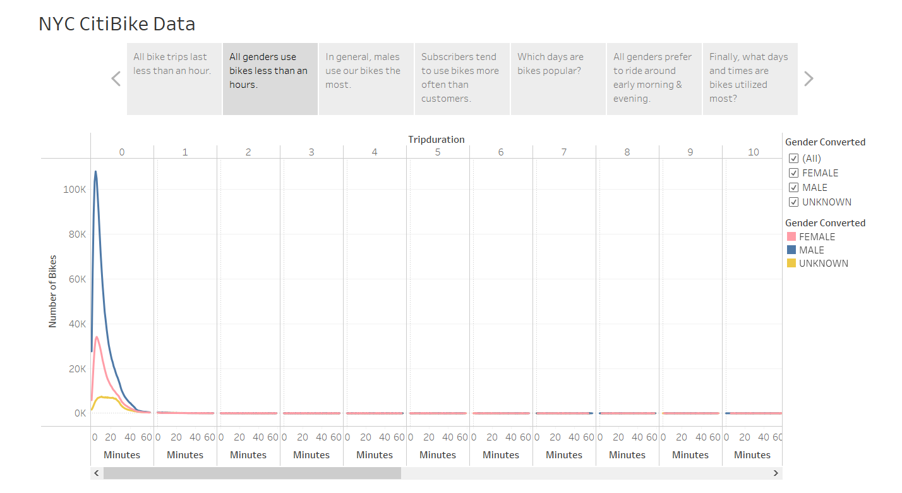
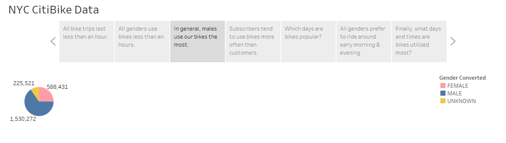
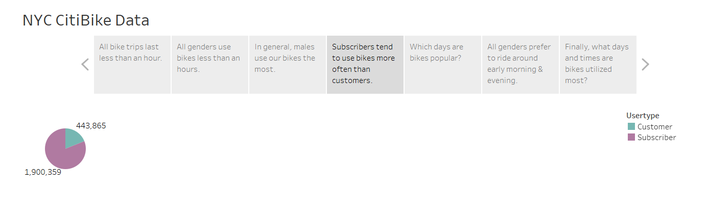
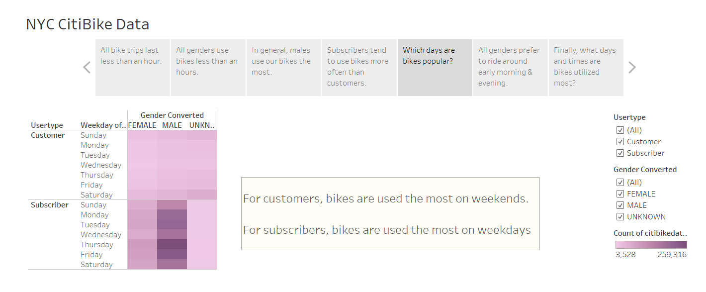
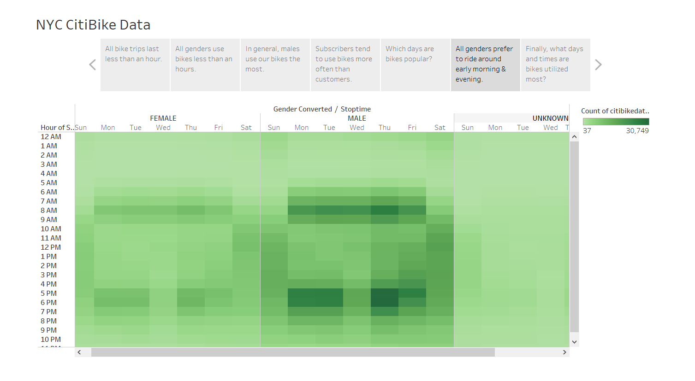
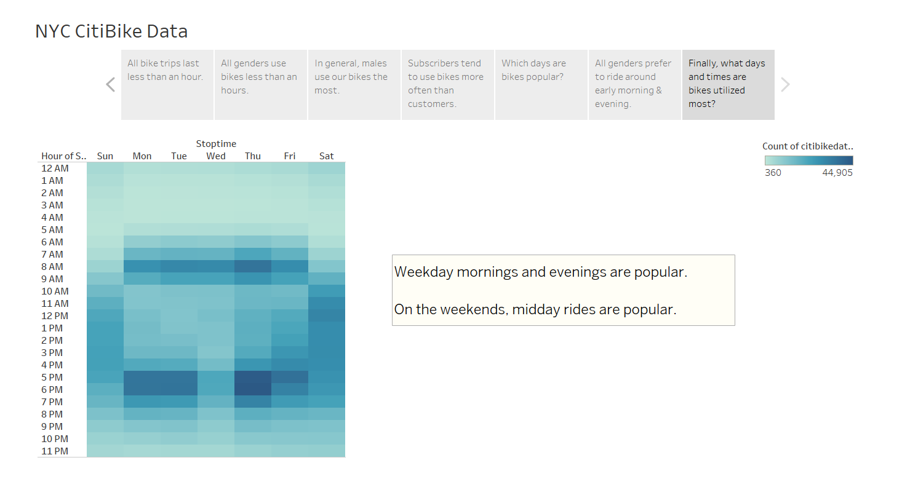

# Bike_Sharing
## Overview:
Recently, a friend and I went sight-seeing in New York. The beauty of the experience was magnified by our bike trip through Central Park where we had an idea. Riding through the fresh air together was fun like childhood, efficient like adulthood, and beautiful as the city we were in. Why not bring the experience to Des Moines in the form of our own start-up? So we took a dive into the data of NYC's CitiBike to explore the possibility.

## Results
The first question I asked myself is how long do consumers actually use the bikes? If the bikes are in use for a very long time, it would be expensive to buy the amount of bikes needed. However, as we can see below, bike trips last less than an hour! 

So a bike is accessible for the next cutomer fairly quickly. Let us look further into detail about who rides the bike for what amount of time was next. 

Why do the gender lines differ?

These are not the only categories to look into 

## Summary
Of the subcribers and customers, what percentage of these are male, female, and unknown?
